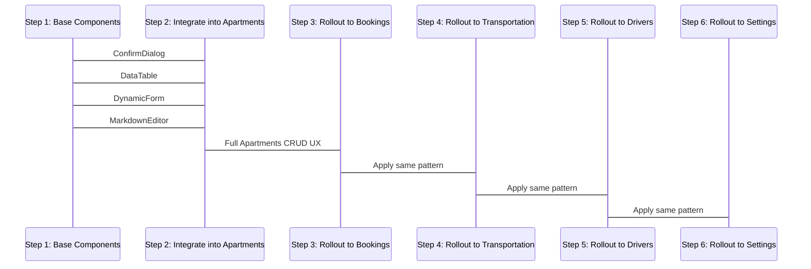

# Admin CRUD UX Architecture Plan

## Goal
Deliver standard professional user friendly CRUD across all admin modules with consistent UX patterns.

## Core UX Requirements (User Request)
1. ✅ **List View** with action icons for add, edit, delete
2. ✅ **Dynamic Add & Edit Form** in modal dialogs, no page reloads
3. ✅ **Delete Confirmation** dialog with validation and message
4. ✅ **Pagination** navigation
5. ✅ **WYSIWYG Markdown Editor** for text areas

## Reusable Component Architecture

### 1. Confirmation Dialog
- **File**: `src/components/admin/confirm-dialog.tsx`
- **Purpose**: Standard delete/action confirmations
- **Props**:
  - title, description
  - confirm/cancel text
  - loading state
  - variant (default/destructive)
- **API**: Use with `useState()` to control open state
- **Behavior**: Close on cancel, call `onConfirm()` on confirm

### 2. Data Table Component
- **File**: `src/components/admin/data-table.tsx`
- **Purpose**: Standard listing layout with actions
- **Features**:
  - Row columns header mapping
  - Action column (edit/delete icons)
  - Integrated pagination
  - Add button at top right
  - Empty state
- **Usage pattern**:
  ```tsx
  <DataTable
    data={items}
    columns={[
      { key: 'name', label: 'Name' },
      { key: 'category', label: 'Category' },
    ]}
    pagination={{ total: 0, currentPage: 1, onPageChange: (p) => setPage(p) }}
    onEdit={(item) => setEditItem(item)}
    onDelete={(item) => deleteItem(item.id)}
    onAdd={() => setEditItem(null)}
  />
  ```

### 3. Dynamic Form Dialog
- **File**: `src/components/admin/crud-modal-form.tsx`
- **Purpose**: Add/Edit modal form shared across all modules
- **Features**:
  - Dynamic field rendering
  - Submit state management
  - Error display
  - Cancel / Submit buttons
- **Pattern**: Form schema definition, no repeated markup

### 4. WYSIWYG Markdown Editor
- **File**: `src/components/admin/markdown-editor.tsx`
- **Purpose**: Drop-in replacement for `<Textarea />`
- **Features**:
  - Toolbar (bold, italic, lists, links)
  - Markdown syntax
  - Preview toggle
  - Minimum height styling

## Rollout Sequence



## Module Rollout Order
1. ✅ **Apartments** (template implementation first)
2. ⏳ Bookings
3. ⏳ Transportation
4. ⏳ Drivers
5. ⏳ Settings

## Implementation Checklist
- [ ] Create `confirm-dialog.tsx`
- [ ] Create `data-table.tsx`
- [ ] Create `crud-modal-form.tsx`
- [ ] Create `markdown-editor.tsx`
- [ ] Upgrade Apartments page to use all shared components
- [ ] Test Apartments UX end-to-end
- [ ] Apply pattern to Bookings
- [ ] Apply pattern to Transportation
- [ ] Apply pattern to Drivers
- [ ] Apply pattern to Settings

## Notes
- All components will use existing UI primitives (Dialog, Button, Dropdown) already present in the project
- No external dependencies beyond what is already installed
- Pattern will be consistent across all admin modules
- No code duplication between admin CRUD pages
